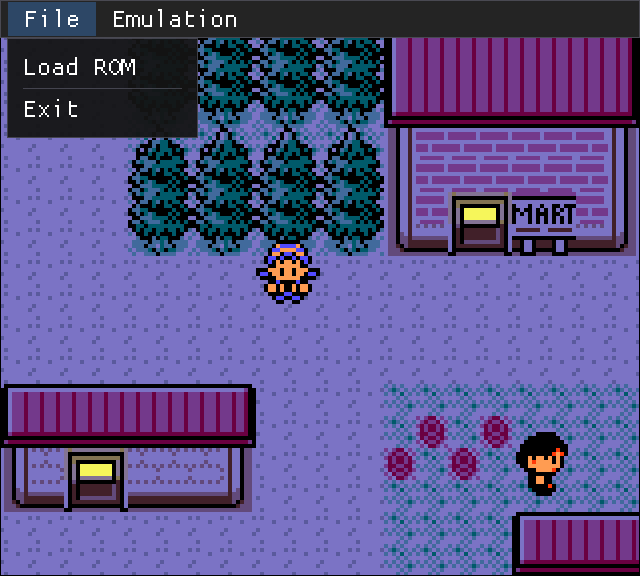
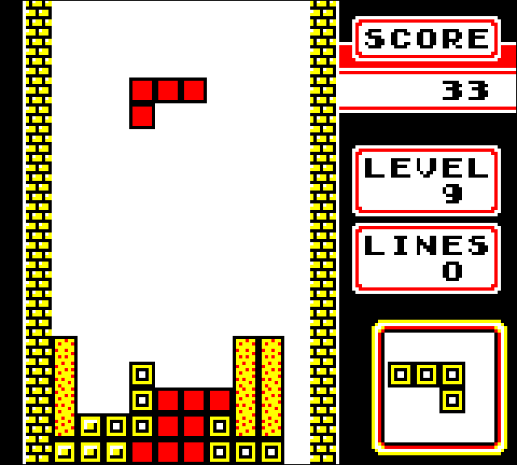

# ChimpGB - Game Boy Emulator

ChimpGB is a cross platform Game Boy (DMG) and Game Boy Color (CGB) emulator written in C++.

[Try a demo in your browser!](https://tomas7770.github.io/chimp-gb-web-demo/)

<picture>
    
</picture>
<picture>
    
</picture>

## Supported platforms

- 🪟 Windows
- 🐧 Linux
- 🌐 Web (Experimental)

Other platforms (e.g. macOS) may function but are not tested or officially supported.

## Development status

- Most games should run properly

- Passes 100% of the [Gameboy CPU (Sharp LR35902) Tests](https://github.com/SingleStepTests/GameboyCPUTests)

- Passes 100% of [Blargg's](https://github.com/retrio/gb-test-roms/tree/master) cpu\_instrs, instr\_timing, and mem\_timing tests

- Passes [dmg-acid2](https://github.com/mattcurrie/dmg-acid2) and [cgb-acid2](https://github.com/mattcurrie/cgb-acid2) PPU tests

Detailed status:

- All of Game Boy's base hardware is implemented (except Link Cable and Infrared)

- Implemented MBCs:

    - MBC1 (except variants with ROM >= 1 MiB)

    - MBC3

    - MBC5 (except variants with rumble)

## Compiling (desktop)

ChimpGB requires the following tools and libraries to build:

- CMake 3.7 or newer

- C++20 compiler (such as g++)

- Make/Ninja or equivalent

- SDL2

In Linux, these should be available through your distribution's package manager.

In Windows, you can use the [MSYS2](https://www.msys2.org/) environment or [Visual Studio](https://visualstudio.microsoft.com/).

Run the following commands to compile an optimized build:

```
cmake -S. -Bbuild -DCMAKE_BUILD_TYPE=Release
cmake --build build
```

To enable debugging, replace `Release` with `RelWithDebInfo` or `Debug`.

## Compiling (web)

Install the [Emscripten SDK](https://emscripten.org/).

Then run the following commands:

```
emcmake cmake -S. -Bbuild -DCMAKE_BUILD_TYPE=Release
cd build/
emmake make
```

The files `ChimpGB.js` and `ChimpGB.wasm` should be generated. These contain the emulator. You then need a web shell in which to place it. The following sections explain some examples.

### Embed with game

To embed ChimpGB with a game in a web page, copy `web/index.html` and place it in the same directory as the compiled files. Also place a file named `rom.gb` containing the game.

This is useful for uploading games to websites such as [itch.io](https://itch.io/), and allowing them to be played directly on the web browser. In this case, create a zip file containing the following files:

- `ChimpGB.js`
- `ChimpGB.wasm`
- `index.html`
- `rom.gb`

Note that distributing commercial games without permission is often **illegal**! The developers of ChimpGB are not responsible for such unauthorized distributions. Only distribute games you're allowed to.

### Dedicated emulator page

For an example of a full web page containing the emulator with some games and the ability to load ROMs from the user's device, check this [demo](https://github.com/tomas7770/chimp-gb-web-demo).

## Usage

Open ChimpGB and use the built-in GUI to load a ROM file.

ChimpGB can also be run from the command line:

```
ChimpGB [<rom file>] [-debug]
```

`<rom file>` is the path to a valid Game Boy ROM. If not provided, no ROM will be loaded at startup.

`-debug` is an optional parameter that prints executed CPU opcodes to stdout.

## Default controls

- **D-Pad:** Arrow keys

- **A:** Z

- **B:** X

- **Start:** Enter

- **Select:** Right shift

- **Show menu bar:** Escape

- **Fast Forward:** Tab

- **Fullscreen:** F11

Controls can be changed within the emulator GUI or in the configuration file.

## Saves location

- **Windows:** `C:\Users\username\Saved Games\ChimpGB`

- **Linux:** `$XDG_DATA_HOME/ChimpGB`

    - If `$XDG_DATA_HOME` is not set, it defaults to `~/.local/share`.

Note that not all games save data, in which case a save file won't be present.

## Config location

- **Windows:** `C:\Users\username\AppData\Local\ChimpGB\ChimpGB.ini`

- **Linux:** `$XDG_CONFIG_HOME/ChimpGB/ChimpGB.ini`

    - If `$XDG_CONFIG_HOME` is not set, it defaults to `~/.config`.

## References

This is a non-exhaustive list of references used in the development of this emulator. It mostly consists of technical documentation about Game Boy hardware, and useful tests that ensure the correctness of the emulator.

- [Game Boy Pan Docs](https://gbdev.io/pandocs/)

- [Game Boy: Complete Technical Reference](https://gekkio.fi/files/gb-docs/gbctr.pdf)

- [RGBDS CPU opcode reference](https://rgbds.gbdev.io/docs/v0.9.3/gbz80.7)

- [Game Boy CPU internals](https://gist.github.com/SonoSooS/c0055300670d678b5ae8433e20bea595)

- [The Cycle-Accurate Game Boy Docs](https://raw.githubusercontent.com/geaz/emu-gameboy/master/docs/The%20Cycle-Accurate%20Game%20Boy%20Docs.pdf)

- [Gameboy sound hardware](https://gbdev.gg8.se/wiki/articles/Gameboy_sound_hardware)

- [MBC3 RTC save format](https://bgb.bircd.org/rtcsave.html)

- [Gameboy CPU (Sharp LR35902) Tests](https://github.com/SingleStepTests/GameboyCPUTests)

- [Blargg's Gameboy hardware test ROMs](https://github.com/retrio/gb-test-roms)

- [Gameboy Doctor](https://github.com/robert/gameboy-doctor)

- [dmg-acid2](https://github.com/mattcurrie/dmg-acid2)

- [cgb-acid2](https://github.com/mattcurrie/cgb-acid2)

- [MBC3 RTC test ROM](https://github.com/aaaaaa123456789/rtc3test)

## Credits

ChimpGB was developed by [tomas7770](https://github.com/tomas7770).

It contains the following third-party libraries:

- [A fork of mINI](https://github.com/IruzzArcana/mINI) with support for stringstream.
- [Dear ImGui](https://github.com/ocornut/imgui)
- [tinyfiledialogs](https://sourceforge.net/projects/tinyfiledialogs/)
