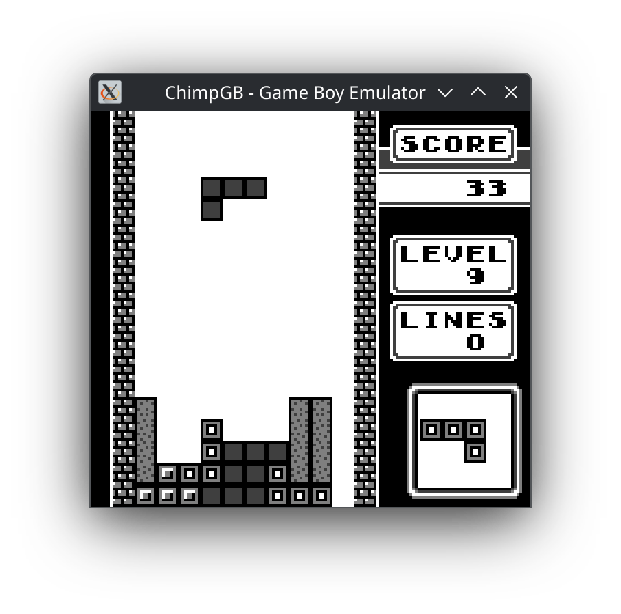

# ChimpGB - Game Boy Emulator
## Note: This project is a WIP.

ChimpGB is an open source, cross platform Game Boy (DMG) emulator written in C++.

<picture>
    
</picture>

## Development status

ChimpGB is in early development stages.

- Passes 100% of the [Gameboy CPU (Sharp LR35902) Tests](https://github.com/SingleStepTests/GameboyCPUTests)

- Passes 100% of [Blargg's](https://github.com/retrio/gb-test-roms/tree/master) cpu\_instrs, instr\_timing, and mem\_timing tests

- Passes [dmg-acid2](https://github.com/mattcurrie/dmg-acid2) PPU test

- Tested on Ubuntu 24.04

- Tested, working games:

    - Tetris

    - Dr. Mario

    - Super Mario Land

    - Kirby's Dream Land

Detailed status:

- **CPU:** fully implemented, except for **STOP** opcode

- **PPU/LCD:** mostly implemented

- **APU:** mostly implemented

- **Implemented MBCs:**

    - MBC1 with ROM <= 512 KiB

    - MBC3 with RAM and battery

        - Data saving is not implemented yet. **Saved data WILL BE LOST!**

- **Misc:** Timer and Divider implemented, Joypad input partially implemented

## Compiling

ChimpGB requires the following tools and libraries to build:

- CMake 3.7 or newer

- C++20 compiler (such as g++)

- Make/Ninja or equivalent

- SDL2

- nlohmann_json 3.11.0 or newer

Run the following commands:

```
cmake -S. -Bbuild
cmake --build build
```

## Usage

Run ChimpGB from the command line:

```
ChimpGB <rom file> [-debug]
```

`<rom file>` is the path to a valid Game Boy ROM. `-debug` is an optional parameter that prints executed CPU opcodes to stdout.

## Controls

Currently, the controls are hardcoded. They'll be configurable in a future version.

- **D-Pad:** Arrow keys

- **A:** Z

- **B:** X

- **Start:** Enter

- **Select:** Right shift

In addition, holding **Tab** will run the emulator at fast forward speed.

## References

This is a non-exhaustive list of references used in the development of this emulator. It mostly consists of technical documentation about Game Boy hardware, and useful tests that ensure the correctness of the emulator.

- [Game Boy Pan Docs](https://gbdev.io/pandocs/)

- [Game Boy: Complete Technical Reference](https://gekkio.fi/files/gb-docs/gbctr.pdf)

- [RGBDS CPU opcode reference](https://rgbds.gbdev.io/docs/v0.9.3/gbz80.7)

- [Gameboy sound hardware](https://gbdev.gg8.se/wiki/articles/Gameboy_sound_hardware)

- [Gameboy CPU (Sharp LR35902) Tests](https://github.com/SingleStepTests/GameboyCPUTests)

- [Blargg's Gameboy hardware test ROMs](https://github.com/retrio/gb-test-roms)

- [Gameboy Doctor](https://github.com/robert/gameboy-doctor)

- [dmg-acid2](https://github.com/mattcurrie/dmg-acid2)
